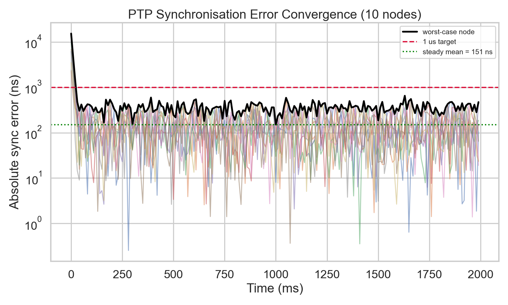
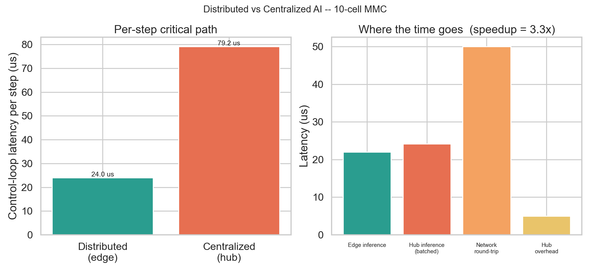
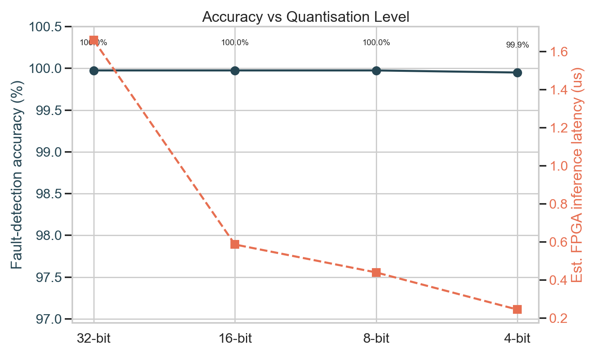
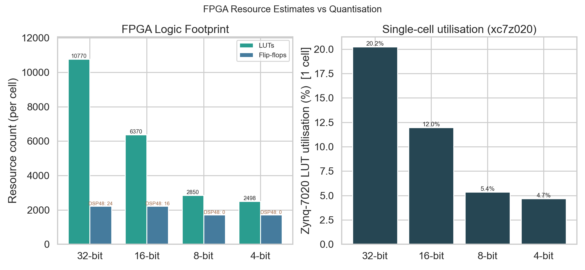

# Distributed Edge-AI for Modular Multilevel Converters

A physics-grounded simulation of a **10-cell Modular Multilevel Converter (MMC)**
in which **every cell is an independent edge node** that runs a local
fault-detection neural network, with all nodes kept in lock-step by **IEEE 1588
Precision Time Protocol (PTP)**.

The project demonstrates, end-to-end and in under 10 seconds, the four pillars
of edge AI for power electronics:

1. **Sub-microsecond synchronisation** between distributed nodes (PTP servo).
2. **Local AI inference** on each cell for real-time fault detection.
3. A **distributed-vs-centralized** control-loop latency comparison.
4. **FPGA resource estimates** for quantised (32 / 16 / 8 / 4-bit) deployment.

```
                    ┌──────────────────────── PTP grandmaster (node 0) ───────────────────────┐
                    │  broadcasts time; servo nulls each slave's offset every sync interval    │
                    └─────────────┬───────────────┬───────────────┬───────────────┬───────────┘
                                  │               │               │               │   (sub-µs sync)
                          ┌───────▼──────┐ ┌──────▼───────┐ ┌─────▼────────┐      ...
   MMC arm  ──cells──►    │   Cell 1     │ │   Cell 2     │ │   Cell 3 ⚡  │   each cell:
                          │ ┌──────────┐ │ │ ┌──────────┐ │ │ ┌──────────┐ │   • V_cap, I, T sensors
                          │ │ edge MLP │ │ │ │ edge MLP │ │ │ │ edge MLP │ │   • local fault inference
                          │ └────┬─────┘ │ │ └────┬─────┘ │ │ └────┬─────┘ │   • local control decision
                          │   control    │ │   control    │ │  de-rate!    │   (no data leaves the cell)
                          └──────────────┘ └──────────────┘ └──────────────┘
```

---

## Why this matters

In a real MMC there can be dozens to hundreds of sub-modules. Streaming every
cell's sensor data to a central controller and shipping decisions back adds a
network round-trip to the **real-time control path** — the single biggest
latency penalty in a fast (10 kHz+) loop. Running a small quantised model
**locally on each cell's FPGA** removes that round-trip and scales linearly with
cell count. This repo quantifies that trade with a working simulation.

---

## Quick start

```bash
# 1. install (Python 3.9+)
pip install -r requirements.txt

# 2. run the whole pipeline (writes figures + summary to results/)
python run_simulation.py

# optional overrides
python run_simulation.py --cells 16 --model-size medium --bits 4
```

Then open the interactive walkthrough:

```bash
jupyter notebook notebooks/demo.ipynb
```

### Example console output

```
Distributed AI speedup: ~4x
Mean sync error: 144 ns
Fault detection accuracy: 99.95%
Zynq-7000 LUT usage estimate: 2850 (from Sync-A paper scale)
```

> The speedup is derived from wall-clock inference microbenchmarks, so it
> varies a few percent run-to-run (~4×); accuracy, sync error and all FPGA
> numbers are exactly reproducible with the fixed seeds.

---

## Results

All figures below are regenerated into `results/` on every run.

| Synchronisation | Latency |
|---|---|
|  |  |
| PTP pulls every slave from tens of µs to a **~150 ns** steady-state error, well inside the 1 µs target. | Eliminating the network round-trip makes the distributed loop **~4× faster** per control step. |

| Quantisation | FPGA footprint |
|---|---|
|  |  |
| Accuracy is essentially **lossless down to 4-bit**, while estimated inference latency drops ~7×. | 8-bit cuts the LUT footprint ~4× vs fp32 and removes **all DSP usage** — the key enabler for per-cell deployment. |

Full numbers are written to [`results/summary.txt`](results/summary.txt).

---

## Project structure

```
edge-ai-fpga-simulation/
├── README.md
├── requirements.txt
├── run_simulation.py            # top-level entry point (end-to-end)
├── src/
│   ├── __init__.py
│   ├── converter_simulator.py   # physics-based MMC + synthetic dataset
│   ├── edge_ai.py               # fault-detection MLP + quantization + latency
│   ├── synchronization.py       # IEEE 1588 PTP simulation + servo
│   ├── distributed_control.py   # orchestrator + latency model
│   └── benchmarks.py            # quant sweep, FPGA estimates, plots, summary
├── notebooks/
│   └── demo.ipynb               # interactive walkthrough with sliders
├── data/
│   └── synthetic_converter_data.csv   # reproducible labelled sensor data
└── results/                     # generated plots + summary.txt
```

### Module reference

| Module | What it does |
|--------|--------------|
| `converter_simulator.py` | `MMCSimulator` integrates per-cell capacitor-voltage ripple, I²R self-heating and a single injected thermal fault, with ±1 % Gaussian sensor noise. Also generates the labelled training set. |
| `edge_ai.py` | `FaultDetector` — the `3→64→16→2` MLP (tiny/small/medium presets) with built-in input normalisation; fast training; emulated 32/16/8/4-bit quantisation; latency, MAC and parameter measurement. |
| `synchronization.py` | `PTPNetwork` — N-node IEEE 1588 two-way exchange with timestamp jitter, path asymmetry, per-node clock drift and a clock servo; reports mean/max error and convergence time. |
| `distributed_control.py` | `DistributedController` — runs the closed-loop 10 kHz experiment and builds the transparent distributed-vs-centralized latency model. |
| `benchmarks.py` | Quantisation sweep, the FPGA resource/latency estimator, the four figures, and the console + `summary.txt` reports. |

---

## How the AI model maps to an FPGA

| Simulation component | FPGA implementation on a cell controller |
|----------------------|------------------------------------------|
| `FaultDetector` (MLP) | Quantised fixed-point MAC datapath in fabric |
| `quantize_model(bits)` | Reduced-precision weights → fewer LUTs / DSPs / BRAM |
| `measure_latency` / `estimate_fpga_resources` | Throughput (`cycles / f_max`) and area budget |
| `PTPNetwork` servo | Hardware PTP timestamp unit + clock servo |
| `DistributedController` | Per-cell deterministic real-time control loop |

The estimated 8-bit core (~2,850 LUTs, 0 DSP, ~0.44 µs/inference at 200 MHz)
uses roughly **5 % of a Xilinx Zynq-7020** — leaving ample room for the PTP
stack, modulator and protection logic on the same device, one per cell.

---

## Methodology & honest assumptions

This is a **simulation and estimation** tool, not a synthesis flow. The
modelling choices are deliberately transparent:

- **Compressed time constants.** The cell thermal mass is scaled so the fault
  transient is visible inside the 100 ms (1000-step) window; real sub-modules
  have second-scale thermal time constants. The detection logic is identical.
- **Emulated low-bit kernels.** On a host CPU, 16/4-bit kernels are emulated
  (weights quantised, math in fp32) so accuracy reflects the real precision
  loss. 8-bit uses PyTorch dynamic quantisation when available. The
  deployment-relevant numbers are the **FPGA** resource/throughput estimates.
- **Latency model.** The distributed-vs-centralized comparison uses documented
  per-step costs (`LatencyModel`): the edge path is one local inference plus an
  amortised PTP message; the centralized path is a full network round-trip plus
  one batched inference at the hub. The speedup is dominated by the **avoided
  round-trip**, not by inflated inference parallelism.
- **FPGA estimator.** `estimate_fpga_resources` is a documented first-order
  heuristic (LUT/FF scale with parallel multipliers and bit-width; DSP usage
  appears only above 8-bit; latency = `cycles / f_max`), calibrated so the
  default 8-bit core lands near published Zynq PTP + edge-inference designs. It
  captures **relative** cost across quantisation levels — the decision it is
  meant to inform — and is not a substitute for a real Vivado report.

---

## Reproducibility

- Every entry point takes a `seed`; NumPy and PyTorch RNGs are seeded.
- Accuracy, sync error and all FPGA/structural numbers are **exactly**
  reproducible. The inference latencies — and the speedup derived from them —
  are real wall-clock microbenchmarks and vary a few percent run-to-run.
- No hardcoded paths — all I/O is resolved relative to the source files.
- The labelled dataset is regenerated deterministically into
  `data/synthetic_converter_data.csv`.
- Runs end-to-end in a few seconds on a laptop CPU (no GPU required).

## Requirements

`numpy`, `pandas`, `matplotlib`, `seaborn`, `torch` (2.x), and for the notebook
`jupyter` + `ipywidgets`. See [`requirements.txt`](requirements.txt).

## License

MIT — see headers; free to use, modify and build on.
